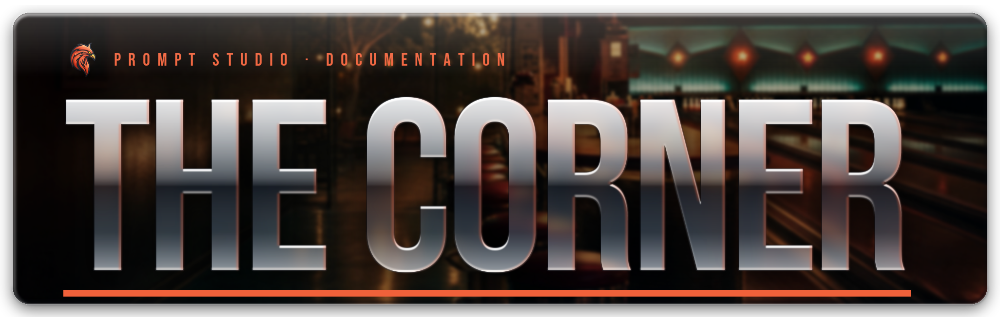

# 🎳 Sandy Shores Bowling, Diner & Steak House

<figure><figcaption></figcaption></figure>

## Sandy Shores Bowling, Diner & Steak House

Known in-world as **The Corner**, this pack adds a full nightlife block to Sandy Shores. Go bowling, play the arcade cabinets, eat a steak, or hang out in the diner — three connected interiors built to give players somewhere to wind down with friends inside the Sandy Shores rework.



***


The Corner ships with the **Prompt Arcade** script, which makes the arcade cabinets playable. The arcade script requires [`ox_lib`](https://github.com/overextended/ox_lib); the map itself is a pure map resource.


### Installation Instructions



#### Step 1 — Add the resource

Place the `prompt_sandy_corner` folder inside your `resources` directory.

<pre><code><strong>resources/prompt_sandy_corner
</strong></code></pre>



#### Step 2 — Add to your server.cfg

Insert the following line to ensure the map loads automatically:

<pre class="language-cfg"><code class="lang-cfg"><strong>start prompt_sandy_corner
</strong></code></pre>



#### Step 3 — Set up MapData

Make sure you have the correct [**Sandy MapData**](sandy-mapdata.md) installed.



#### Step 4 — Test the map

Restart your server and visit **The Corner** in Sandy Shores.\
If the map and interiors load correctly, installation was successful ✅




💡 **Tip:** Always restart your server after adding new resources — especially when adding multiple Sandy area maps.


***

:round\_pushpin:Location: **1921.75, 3869.84, 33.34**

***

### What's Inside

| Area | Description |
| --- | --- |
| **Bowling Alley** | Full alley with lanes, seating, and a separate game room housing the arcade cabinets |
| **Steak Bar** | Sit-down steak restaurant and bar, with custom door audio |
| **Diner & Bar** | Classic roadside Sandy diner with bar and booth seating |
| **Surroundings** | Reworked ground and exterior detailing that blends into the Sandy Shores rework |

***

### Bowling Scripts

The bowling lanes are built to work with an external bowling script. Both of these are compatible, and we ship a **ready-made config for all 6 lanes** for each — copy it in and you're bowling:

1. [RTX Bowling](https://rtx.tebex.io/package/6861196)
2. [rCore Bowling](https://store.rcore.cz/package/5125529)


The map ships the alley itself — lanes, pins, seating, and the surrounding interior. Install one of the scripts above to make the lanes playable.




Add this entry to the bowling-alley table in the RTX Bowling config. It covers all **6 lanes**, the ball racks, and the menu point.


The Corner — RTX Bowling alley entry (all 6 lanes)



The snippet is written as alley **`[1]`**. If your RTX config already has other alleys, change the index to the next free number (e.g. `[2] = { ... }`).


<details>

<summary>Preview — first lane of the snippet</summary>

```lua
[1] = { -- BOWLING 1
    objectanimations = true,
    bowlingstartfee = 100,
    menucoords = vector3(1930.605, 3885.986, 31.886),
    throwsettings = {forcemultiplier = 1.0, rotationtime = 2500},
    balls = { --[[ 9 ball-rack positions — see the file ]] },
    lanes = {
        [1] = {
            screenobject = { coords = vector3(1930.064575, 3896.641846, 34.625732), rotation = vector3(19.58009, 0.0, 29.93), --[[ ... ]] },
            border = {minborder = -0.6, maxborder = 0.4},
            offset  = {coords = vector3(1930.064575, 3896.641846, 31.908186), rotation = vector3(0.0, 0.0, -59.6831)},
            offset2 = {coords = vector3(1923.570923, 3907.931396, 31.908186), rotation = vector3(0.0, 0.0, -59.6831)},
            pins = { --[[ 10 pin positions — see the file ]] },
        },
        -- lanes [2]..[6] in the download
    },
},
```

</details>



Merge **4 small blocks** into your existing `rcore_bowling` config — the download contains exactly these, marked 1–4:

1. **`Config.Blips`** — add: `vector3(1928.48, 3881.6, 31.6)`
2. **`Config.EnabledMaps`** — add: `PROMPT_SANDY_BOWLING = true,`
3. The **`POINTS_PROMPT_SANDY_BOWLING`** table
4. The **`Lanes.PROMPT_SANDY_BOWLING_1..6`** block (goes at the bottom with the other map blocks)


The Corner — rcore\_bowling additions (all 6 lanes)



The lanes reference rcore's stock **`POINTS_M4A`** table, which ships with the script — nothing else to install.


<details>

<summary>Preview — first lane of the snippet</summary>

```lua
Lanes.PROMPT_SANDY_BOWLING_1 = {
    SourcePoints = POINTS_M4A,
    PinDistance = 12.1,
    Width = 0.64,
    GutterDepth = 0.17,
    AngleOffset = 0.0,
    BallPickupOffsetMultiplier = 0.9,
    PinSideSpace = 0.375,
    End = vec3(1923.57, 3907.88, 32.61),
    IsClosestToDoor = true,
    GutterWidth = 0.8,
    SourceSide = 'LEFT',
    SourceRoot = vector3(1931.7293701172, 3895.8603515625, 32.449890136719),
    Start = vector3(1929.9914550781, 3896.6337890625, 31.928340911865),
    BallPickupZOffset = -0.55,
    Place = 'prompt_sandy_bowling',
}
-- lanes 2..6 in the download
```

</details>



***

### Arcade Games

The bowling alley's game room is filled with playable cabinets, run by the bundled **Prompt Arcade** script. Walk up to a cabinet and interact to play.

| Game | Players |
| --- | --- |
| Space Monkey | 1 |
| The Wizard's Ruin | 1 |
| Claw Machine | 1 |
| Nazar the Fortune Teller | 1 |
| Badlands Revenge | 2 (split screen) |
| Race and Chase: Crotch Rockets | 2 (split screen) |
| Race and Chase: Get Truckin' | 2 (split screen) |
| Race and Chase: Street Legal | 2 (split screen) |
| Love Tester | 2 |


Interaction uses **ox\_target** or **qb-target**, auto-detected at runtime — whichever you already run. If neither is present, the script falls back to its own interaction handling.


<details>

<summary>Adjusting the arcade cabinets</summary>

Cabinet behaviour lives in `config.lua` inside the arcade resource. Each game entry controls its own settings:

* `enabled` — turn an individual game on or off
* `title` — the name shown to players
* `target` — the interaction label and icon

Global defaults at the top of the file control interaction distance (`targetDistance`), how far the script looks for a placed cabinet (`findRange`), and the cooldown between plays (`cooldown`).

</details>

***

### Notes

* The Corner is part of the **Sandy Shores rework** and is designed to sit alongside the other Sandy maps.
* The building is signed as **The Corner** in-world — that's the name players will see.
* The map itself is a pure map resource — no framework required. Only the arcade script needs `ox_lib`.
* Bowling alley interior loads at `1931.5, 3893.69, 33.61`.

***

### 🔒 Wanted: ox\_doorlock door data


We're looking for someone to create the **`ox_doorlock` SQL** (door definitions) for The Corner's interior doors. Do it well and we'll reward you with a **20% discount coupon** for the store.

Interested? Reach out in the [Prompt Studio Discord](https://discord.gg/rKbHHdfZFU).


***

Need help? Join the [Prompt Studio Discord](https://discord.gg/rKbHHdfZFU) for support, bug reports, and feedback. Enjoy The Corner on your FiveM server! 🚀
