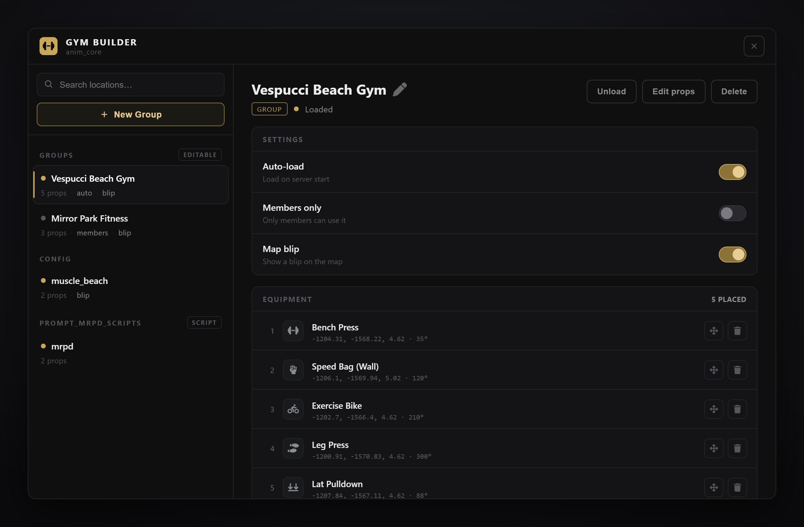

# Animations Core 2.0

## Animations Core 2.0

### Prompt Anim Core

***

<figure><figcaption><p>The <strong>Gym Builder</strong> (<code>/gymcreator</code>) — build and manage gyms in-game: groups auto-save as you place, and map blips / members-only toggle live</p></figcaption></figure>

<details>

<summary><strong>Overview</strong></summary>

<br>

Prompt Anim Core 2.0 is a standalone gym equipment system for FiveM that provides:

* **Location-based gym management** (spawn equipment by location)
* Multiple **equipment types** with synchronized animations
* **Gym Builder NUI panel** — create, edit, and manage gyms without touching config files; groups auto-persist as you build
* **Membership system** — optionally restrict gym usage to members, with admin commands and exports
* **Clear Location** feature (hide vanilla objects inside a radius)
* Optional **boxing ring** support
* Admin placement tool: **`/gymcreator`**
* Developer exports for spawning/removing equipment, managing locations, and membership
* **Hooks** — per-machine custom logic (allow/deny, on start, on end) without touching core files
* **3D sound cues** per machine (entrance / rep / exit / loop), synced client-side to the animation
* Client-server synchronization + resource-based cleanup

</details>

***

<details>

<summary><strong>What's new in 1.7.0</strong></summary>

<br>

**Lung capacity** — a fifth stat, trained by the bike, the rowing machine and the treadmill. It sets how long a player can stay underwater: 10 s untrained, up to 50 s at 100.

* **Stat exports.** `GetStats` / `UpdateStats` / `AddStats` / `RemoveStats` on the server and `GetStats` on the client, with rtx_gym's names and shapes — other scripts can read and train gym stats directly. Contract in `exports.md`.
* **One stat list.** `stats.definitions` in `config_s.lua` now defines every stat (name, decay, menu look). Adding a stat is one entry, its `rates`, and two locale keys — no engine files. Old configs without the list keep working on the original four.
* **Upgrade note.** This version adds a server file: do a **full server restart**, not a plain `restart`. If you added your own stat exports to `config/server.lua`, delete them — they are built in now.

</details>

***

<details>

<summary><strong>What's new in 1.6.0</strong></summary>

<br>

**Treadmill** — the first continuous machine. Step on, `E` cycles walk → run → sprint (wrapping back to walk), `X` steps off. Stats accrue per stride cycle — time-based, not rep-based — with per-speed multipliers tunable in `config_c.lua`.

* **Training summary.** Leaving a machine shows the muscles worked, reps performed, and each stat's gain + new total. Muscle labels are per-machine config (`muscles = { 'chest', 'triceps' }`), localized in all 12 languages; render replaceable via `client.trainingSummary` in `config/client.lua`.
* **Custom tooltip seam.** `customTooltip(machine, show)` in `config_c.lua` fires when a player gets on/off a machine, in both `progressBar` modes — for servers replacing the built-in UI with their own hints.
* **Fixes.** Failing the minigame no longer grants the rep/stat (built-in and custom `client.minigame`); push-up/sit-up mat names fixed on the 11 non-English languages; `rtx_gym` stat mapping corrected; a hidden dev preview menu no longer registers at startup (errored on lation_ui servers); unused `repetitions` config key removed.

</details>

***

<details>

<summary><strong>What's new in 1.5.0</strong></summary>

<br>

**Four new machines** — **Bench Press**, **Pull-Up Bar**, **Push-Up Mat** and **Sit-Up Mat**, animated with Mansion DLC clips streamed by the resource (no game-build requirement).

* **One mat, several exercises.** A placed yoga mat now shows a target option for push-ups, sit-ups and yoga instead of needing a mat each. The exercise a player picks is what every other player sees, including anyone who joins mid-session.
* **Mark props for removal is back** in the Gym Builder (group detail -> *Removed props*). Marked world clutter now disappears the moment you confirm it, and marks save immediately instead of only when the group reloads.
* **Fixes.** Props whose model origin isn't at their base no longer float when placed; animation dictionaries consolidated (9 per-machine prop dicts merged into 1).

</details>

***

<details>

<summary><strong>What's new in 1.3.2</strong></summary>

<br>

**Gym Builder rework.** `/gymcreator` now opens a single custom NUI panel instead of the old ox_lib debug menu — the old creator menu and the old ox_lib group menu are both removed.

* **Groups auto-persist.** Creating a group and every prop add/move/delete writes to `groups/saved_groups.json` immediately — there's no Save button, and props spawn live/incrementally as you place them.
* **Config and script locations, read-only.** Locations from `config_c.lua` and locations registered by other resources via `CreateGymLocation` are listed read-only, grouped by source (config vs. per-resource).
* **Per-location override flags.** Every read-only location can have `requireMembership` and `blip` overridden from the panel without touching config files or the owning script — overrides persist to `groups/location_overrides.json` and win over whatever the export/config passed (UI override > export/config value > engine default). Legacy `CreateGymLocation` calls that never set these flags keep working unchanged.
* New export **`SetLocationBlip(locationName, enabled)`** — live map-blip toggle for a dynamic location, twin of `SetLocationMembership`.
* Placement still shows the heading arrow + a green ped-position dot; there is no wall/collision detection.

</details>

***

<details>

<summary><strong>What's new in 1.3.1</strong></summary>

<br>

**Third-party stat providers.** anim_core can now feed **rtx\_gym**, **vms\_gym**, **OT\_skills**, or **devhub\_skillTree** instead of its own stat system — set `stats.provider` in `config_s.lua` and every completed rep is pushed into that resource's stat/XP database through its public exports. The provider keeps owning decay, item boosters, and gameplay effects (anim_core's own modifiers and decay switch off automatically, so nothing double-applies), and `/gymstats` shows the provider's values — with vms\_gym, OT\_skills, and devhub\_skillTree it opens the provider's own menu. Ships with ready mappings for vms\_gym, OT\_skills, and devhub\_skillTree; for rtx\_gym fill the stat names from their documentation into `stats.providerMap`. OT\_skills and devhub\_skillTree are XP-based, so per-rep gains push as XP (banked to whole numbers, nothing lost to rounding) — tune each with the per-provider `stats.xpScale` (devhub feeds a whole category, e.g. `personal`, and wants a bigger scale since its levels need ~100 XP).

* New **`onRep`** hook event — fires server-side for every completed rep; wire any other XP/stat/drug system there
* New **`statMultiplier`** editable function (`config/server.lua`) — scale pushed gains, e.g. to honor a provider's booster items
* **Equipment sounds ship wired** — 5 machines have 3D rep cues out of the box (wall + standing punch bags, wing chun dummy, lat pulldown, bike), each authored to its animation length, in the resource's own `promptgym` audio bank; add or swap cues per the Equipment Sounds section
* **Per-call blip opt-out** — `CreateGymLocation(..., { blip = false })` registers a location without a map blip (prison/interior gyms)
* Fixed: `stats.enable = false` now also stops per-rep stat gains (previously it only stopped decay), and the exhaustion recovery loop no longer depends on the stats system being enabled

</details>

***

<details>

<summary><strong>What's new in 1.3.0</strong></summary>

<br>

**Rebuilt synchronization engine.** The server no longer spawns networked props — every client renders its own local equipment, viewers pin the user's ped at the exact seat position (no floating or sliding on machines), and exercises replay in step on every screen. This fixes the long-standing issues where other players saw someone standing inside a machine, saw no equipment motion, or saw a "ghost rep" when someone sat down. Late joiners now see machines in use correctly, and cleanup is identical whether a player exits normally or crashes.

**New features:**

* **Hooks system** (`hooks/` folder) — gate machine use and react to start/end per spot, server- and client-side, crash-safe (fail-open)
* **3D sound cues** — optional `sounds` block per equipment type (start / rep / stop / loop), played per prop and per client
* **`restAnimation`** — dedicated rest loop per machine (the bench ships with one)
* **Per-call membership** — `CreateGymLocation(..., { requireMembership = true/false })` plus `GetDynamicLocation` / `SetLocationMembership` exports
* **Client exports** — `IsPlayerAnimated()` / `StopPlayerAnim(instant)` so death/cuff/admin scripts can release a player cleanly
* **ultraDebug** — live sync telemetry from every client into the server console for support

**Updating from 1.2.x:** drop-in — configs and exports are backward compatible. The update adds new files, so do a **full server restart** and have players **reconnect** (a plain `restart` won't load new files).

</details>

***

### Installation Instructions




#### Step 1 — Install dependencies

Ensure these resources are installed:

* **ox\_lib** (required)
* **ox\_target** (optional, recommended)
  



#### Step 2 — Install Prompt Anim Core

Place the resource folder in your `resources` directory:

<pre><code><strong>resources/prompt_anim_core_2_new
</strong></code></pre>





#### Step 3 — Start order (server.cfg)

Add this to your `server.cfg` (keep the order):

<pre class="language-cfg"><code class="lang-cfg"><strong>ensure ox_lib
</strong><strong>ensure ox_target   # Optional but recommended
</strong><strong>ensure prompt_anim_core_2_new
</strong></code></pre>





#### Step 4 — Restart & test

Restart your server and run:

* `/gymcreator`

If you can place equipment and interact with it (target or TextUI), installation was successful ✅

[](https://discord.gg/rKbHHdfZFU)



***


**Tip:** Keep `ox_lib` above this resource in your cfg. It provides menus, callbacks, notifications, and fallback zones used by the system.


***

<details>

<summary><strong>Configuration</strong></summary>

<br>

#### Server Config (`config/config_s.lua`)

```lua
{
    debug = false,            -- Debug logging: also relays every client's sync log into the SERVER console
    ultraDebug = false,       -- With debug: doer + viewers stream live anim/prop state 2x/sec (support tool)

    enableMinigame = false,   -- Enable skill check minigame when starting exercises

    gymCreator = {
        enable = true,
        restricted = 'group.admin',  -- ACE restriction for /gymcreator (false = unrestricted)
        canAccess = function(source) -- Extra custom permission logic on top of the ACE check
            return true
        end,
    },

    exhaustion = {
        enable = false,              -- Fatigue system (slows rep speed as muscles tire)
        recoveryRate = 0.01,         -- Recovery per minute
        enableMuscleGroups = true,   -- Track per muscle group
        muscleGroups = { ... },      -- Which equipment trains which muscle group
        rates = { ... },             -- Exhaustion added per exercise, per equipment type
    },

    groups = {
        enable = true,               -- Groups system (Gym Builder panel via /gymcreator)
        creatorCanEdit = true,       -- Original creator can edit without admin
        creatorCanDelete = false,    -- Original creator can delete without admin
        despawnCheckInterval = 10000, -- Re-check for respawned world props (ms)
    },

    membership = {
        enable = false,              -- When true, ALL gym locations require membership
        exemptLocations = {          -- Locations that never require membership
            -- 'prison',
        },
        commandRestricted = 'group.admin',  -- ACE restriction for membership commands
    },

    stats = {
        enable = true,               -- Stat progression
        definitions = { ... },       -- THE stat list: name, decay/min, /gymstats icon + colours (5 ship; add your own here)
        provider = 'internal',       -- 'internal' | 'rtx_gym' | 'vms_gym' | 'OT_skills' | 'devhub_skillTree' — push gains into a third-party stat system instead
        providerMap = { ... },       -- anim_core stat -> provider stat/skill/category name (rtx + vms + OT_skills + devhub_skillTree mappings ship ready)
        rates = { ... },             -- Stat gains per exercise, per equipment type
        decrease = {                 -- Stats decay over time when not training (internal provider only)
            enable = true,
            multiplier = 1.0,        -- Global decay speed (0.5 = half, 2.0 = double); per-stat rates are definitions[].decay
        },
    },
}
```

***

#### Client Config (`config/config_c.lua`)

Key sections:

```lua
{
    language = 'auto',           -- 'auto' or one of 12 shipped locales (en, es, fr, de, pt, ru, it, pl, zh, ko, sv, ar)
    renderDistance = 100.0,      -- Distance to render gym locations
    interaction = 'auto',        -- 'auto', 'ox_target', 'qb_target', 'textUI', 'custom'
    target = {                   -- Target option appearance (ox_target / qb-target)
        icon = 'fa-solid fa-dumbbell',
        distance = 2.0,
    },
    keybinds = {                 -- DEFAULT keys (players still rebind per-player in GTA settings)
        rep = 'E',
        exit = 'X',
    },
    progressBar = 'built-in',    -- 'built-in' or 'custom' (see below)

    blip = {
        enable = true,           -- Master on/off for ALL gym blips
        sprite = 311,
        color = 21,
        scale = 0.9,
        label = 'Gym',           -- Fallback label for a location with no `name` of its own
        -- One blip per gym location (config locations, groups, script-created),
        -- labelled by the location's own `name` or `label` above. Blips add/remove
        -- and toggle live via GlobalState['gym:map'] — no restart.
    },

    boxingRing = {
        enable = true,
        model = "vision_gymboxingring",
        roundDuration = 60,      -- Round duration in seconds
        cancelDistance = 6.0,    -- Leave this radius mid-fight = you lose
        showBoundary = true,     -- Red sphere boundary shown during the fight
        coords = { ... },        -- Ring placements (vec4)
        conditionalCoords = {    -- Rings that only exist while a resource is running (MLO rings)
            { resources = { 'prompt_prison_study' }, coords = vec4(x, y, z, h), cancelDistance = 6.1 },
        },
    },

    locations = {
        ['my_gym'] = {
            coords = vec3(x, y, z),
            -- requireMembership = false,  -- Optional: exempt from membership
            props = { ... },
        },
    },

    props = { ... },  -- Equipment type definitions (models, animations, sounds, restAnimation)
}
```

**Custom progress bar** — set `progressBar = 'custom'` and implement the function in the same file:

```lua
customProgressBar = function(machine, duration)
    exports['your-progressbar']:Start(duration)
end
```

**Custom tooltip** — `customProgressBar` only fires after the player presses the key to start a rep, so it cannot tell them which key to press. `customTooltip` runs when they get **on** a machine and again when they get **off** it:

```lua
customTooltip = function(machine, show)
    if show then
        lib.showTextUI('[E] Train  \n[X] Stop')
    else
        lib.hideTextUI()
    end
end
```

It is empty by default and fires in **both** `progressBar` modes, so you can layer hints on top of the built-in UI. Remember that `progressBar = 'custom'` hides the built-in hint panel along with the built-in bar — this is the replacement for it. `show = false` also fires on exits the player did not choose (death, zone exit, resource stop), so the tooltip always closes.

***

#### Editable Server Functions (`config/server.lua`)

This file contains functions you can customize:

* `server.canUseMachine(source, data)` — permission check before accessing equipment (membership check runs here automatically)
* `server.canDoExercise(source, data)` — permission check before starting an exercise
* `server.updateStats(source, data)` — stat progression storage (pre-configured for QBCore, QBX, ESX; JSON fallback for standalone)
* `server.getPlayerName(source)` — player name for boxing ring display
* `server.boxingRing.onFightStart / onFightEnd` — match hooks (pre-configured to revive both fighters)

#### Editable Client Functions (`config/client.lua`)

* `client.notify(title, message, type)` — swap in your own notification system
* `client.minigame(machine)` — the skill check used when `enableMinigame = true` (default: ox_lib skillCheck)
* `client.onExerciseStart / onExerciseEnd` — busy-state hooks (default: sets `invBusy`, disables targeting)
* `client.boxingRing.onFightStart / onFightEnd(result)` — client-side match hooks
* `client.trainingSummary(data)` — the post-session card (muscles, reps, each stat's gain and new total); replace the body to draw your own, empty it to switch it off
* `applyGymStats(stats)` — what each stat *does* (sprint, melee, health regen, underwater breath). Add a line here for a stat you added to `stats.definitions`

</details>

***

<details>

<summary><strong>Gym Builder</strong></summary>

<br>

`/gymcreator` opens the **Gym Builder** — a custom NUI panel. It lists every gym location in three groups: your own **Groups** (fully editable), **config locations** (from `config_c.lua`, read-only), and **script locations** (registered by other resources via `CreateGymLocation`, read-only, grouped by resource).

#### Groups — How to Use

1. Run `/gymcreator`
2. **Create Group** — give it a name (and optionally set the create-time `requireMembership`/`blip` flags)
3. **Add Props** — select an equipment type, position it in the world with scroll to rotate, ENTER to place
4. **Move / Delete** props from the panel's prop list at any time

There is **no Save button** — creating the group and every prop add/move/delete writes to `groups/saved_groups.json` immediately, and the prop spawns/updates/despawns live in the world as you edit.

#### From the Panel You Can

* **Load / Unload** groups (spawn/despawn all props)
* **Edit** a loaded group (add/move/delete props)
* **Toggle Auto-Load** — groups with auto-load enabled spawn automatically on server start
* **Toggle Membership Requirement** and **Toggle Map Blip** per group
* **Delete** a group permanently

#### Permissions

* **Admins** (matching `gymCreator.restricted` ACE) can edit/delete any group
* **Creators** can edit their own groups if `groups.creatorCanEdit = true` in config
* **Creators** can delete their own groups if `groups.creatorCanDelete = true` in config
* Creator identity is tracked by player license (framework-agnostic)

#### Read-Only Locations & Overrides

Config and script locations can't be edited (no props, no move/delete) — but each one exposes two switches in the panel:

* **`requireMembership`** — require membership to use equipment at that location
* **`blip`** — show a map blip for that location

Flipping either switch does **not** rewrite `config_c.lua` or the owning script. It writes a per-location override to `groups/location_overrides.json` and, if the location is currently loaded, pushes the change live. Precedence is **UI override > the value the export/config passed > engine default** — so a legacy `CreateGymLocation` call that never sets `requireMembership`/`blip` keeps working exactly as before until you explicitly override it from the panel.

#### Placement Guides

While placing or moving a prop, the world view shows a heading arrow (in front of the prop, along its facing) and a green dot marking where the player will stand/sit for that equipment type. There is no wall/collision detection.

#### Files

* `groups/saved_groups.json` — persistent group storage
* `groups/location_overrides.json` — per-location `requireMembership`/`blip` overrides for config and script locations
* `groups/server_manager.lua` — server-side group logic (CRUD, auto-persist, the `gym_builder:getLocations` panel callback)
* `groups/server_overrides.lua` — the location override store
* `web_creator/` — the Gym Builder NUI (HTML/CSS/JS)

</details>

***

<details>

<summary><strong>Membership System</strong></summary>

<br>

Optionally restrict gym equipment usage to players with an active membership. Disabled by default.

#### Quick Start

1. Set `membership.enable = true` in `config/config_s.lua`
2. All config gym locations now require membership
3. Use `/gymmembership <playerId> [days]` to grant memberships

#### How It Works

When enabled:

* **All config gym locations** require membership by default
* **Individual locations** can opt out: set `requireMembership = false` in the location config
* **Exempt locations** listed in `membership.exemptLocations` never require membership (e.g., `'prison'`)
* **Groups** do NOT require membership by default — toggle per-group in the Gym Builder panel
* **Config/script locations** keep whatever `requireMembership` their export/config set — override per-location from the Gym Builder panel (see the Gym Builder section)

#### Admin Commands

* `/gymmembership <id> [days]` — Grant membership. No days = permanent.
* `/gymrevoke <id>` — Revoke membership from a player.

Both commands require the ACE permission set in `membership.commandRestricted` (default: `group.admin`).

#### Membership Storage

Members are stored in `membership/members.json`:

```json
[
    {
        "license": "license:abc123",
        "playerName": "PlayerOne",
        "grantedBy": "system",
        "grantedAt": 1707500000,
        "expiresAt": 1710092000
    }
]
```

Expired memberships are automatically pruned on server start.

#### Exports (Server-Side)

Other resources can integrate with the membership system:

```lua
-- Check if a player has an active membership
local isMember = exports['prompt_anim_core_2_new']:IsPlayerMember(source)

-- Grant membership (nil days = permanent)
exports['prompt_anim_core_2_new']:GrantMembership(source, 30)

-- Revoke membership
exports['prompt_anim_core_2_new']:RevokeMembership(source)

-- Override the entire membership check with custom logic (ESX/QBCore/etc)
-- Pass nil to restore the default JSON-based check
exports['prompt_anim_core_2_new']:SetMembershipCheckHandler(function(source)
    -- Your custom check here (e.g., check player metadata, inventory item, etc.)
    return true -- or false
end)
```

#### Files

* `membership/server_membership.lua` — all membership logic, exports, commands
* `membership/members.json` — persistent member storage

</details>

***

<details>

<summary><strong>Location System</strong></summary>

<br>

#### Defining Locations (`config/config_c.lua`)

Locations are defined in the `locations` table:

```lua
locations = {
    ['location_name'] = {
        coords = vec3(x, y, z),           -- Required: center point
        renderDistance = 100.0,            -- Optional override
        -- requireMembership = false,      -- Optional: exempt from membership when enabled

        clearLocation = {                  -- Optional: hide vanilla objects
            radius = 20.0,
            additionalObjects = {
                "prop_custom_model_1",
            }
        },

        props = {
            speedbag = {
                vec4(x, y, z, heading),
                vec4(x, y, z, heading),
            },
            bench = {
                -- Simple format: bar attaches to player
                vec4(x, y, z, heading),

                -- Extended format: bar spawns at fixed position
                { coords = vec4(x, y, z, h), bar = vec4(x, y, z, h) },
            },
        }
    }
}
```

#### Clear Location Feature

Hides default/vanilla objects when players enter your gym area:

1. When a player enters the location, the system scans objects within the radius
2. Matches against global `clearLocationModels` + per-location `additionalObjects`
3. Hides matching objects while inside
4. Restores objects when leaving (and on script restart)

#### Boxing Ring (Optional)

Target a placed ring to open the **fight lobby**: two players join, ready up, and fight for the round duration — leaving the boundary (`cancelDistance`, shown as a red sphere when `showBoundary = true`) counts as a loss. Both fighters are revived on start and end (customizable via the `boxingRing` hooks in `config/server.lua` / `config/client.lua`).

```lua
boxingRing = {
    enable = true,
    model = "vision_gymboxingring",
    roundDuration = 60,          -- Seconds per match
    cancelDistance = 6.0,        -- Leave this radius = you lose
    showBoundary = true,         -- Red sphere during the fight
    coords = {
        vec4(x, y, z, heading),
    },
    conditionalCoords = {        -- Rings inside MLOs from other resources:
        {                        -- only exist while one of these is running
            resources = { 'prompt_prison_study' },
            coords = vec4(x, y, z, heading),
            cancelDistance = 6.1,
        },
    },
}
```

</details>

***

<details>

<summary><strong>Equipment Types</strong></summary>

<br>

Available equipment types:

| Type | Model | Description |
| --- | --- | --- |
| `bench` | `vision_gymbench1_pepe` | Bench press (supports extended fixed-bar placement) |
| `vin_chu` | `vin_chu` | Sit-up / core station |
| `leg_press` | `vision_gymlegpress` | Leg press machine |
| `speedbag` | `vision_gymspeedbagwall` | Wall-mounted speed bag |
| `gymbike` | `vision_gymbike` | Exercise bike |
| `gymlatpull` | `vision_gymlatpull` | Lat pulldown machine |
| `gympullmachine1` | `vision_gympullmachine1` | Cable pull machine |
| `gympullmachine2` | `vision_gympullmachine2` | Cable pull machine (variant) |
| `gymrowpull` | `vision_gymrowpull` | Seated rowing machine |
| `gymspeedbag` | `vision_gymspeedbag` | Free-standing speed bag |
| `benchpress` | `prompt_m25_gymbench` | Bench press with rack (Mansion DLC animation) |
| `pullupbar` | `prompt_m25_gympullup` | Pull-up bar (Mansion DLC animation) |
| `pushups` | `prop_yoga_mat_02` | Push-up mat |
| `situps` | `prop_yoga_mat_02` | Sit-up mat |
| `yogamat` | `prop_yoga_mat_02` | Yoga mat (pose sequence) |

`pushups`, `situps` and `yogamat` share one prop, so a single placed mat shows a target option for each exercise — you don't need a mat per exercise. Whatever the player picks is what everyone else sees.

Safe to edit: labels, UI text, zone sizes.
Don't edit unless you know what you're doing: model names, animation dicts/names.

</details>

***

<details>

<summary><strong>Player Controls &amp; Stats</strong></summary>

<br>

#### Controls

* **Target / [E] prompt** — start using a machine
* **E** — perform a rep (keybind `gym:performExercise`)
* **X** — get off the machine (keybind `gym:exitMachine`)

Both keybinds are registered through ox_lib, so players can rebind them in **GTA Settings → Key Bindings → FiveM**. Server owners change the *defaults* via `keybinds` in `config_c.lua`.

#### Player Stats

Training progresses **5 stats**, each with real gameplay effects while the resource is running:

| Stat | Trained by | Effect |
| --- | --- | --- |
| Speed | Leg exercises (leg press, bike) | Faster sprint |
| Stamina | Cardio (bike, rowing) | Better endurance, faster stamina regen, faster swimming |
| Combat | Punching (speed bags, vin chu) | More melee damage |
| Strength | Pulls & bench | Less melee damage taken, faster health regen |
| Lung capacity | Cardio (bike, rowing, treadmill) | Longer underwater breath (10 s → 50 s) |

* Players check their progress with **`/gymstats`** (progress-bar menu, no permission needed)
* Stats **decay over time** when not training (`decay` per stat in `stats.definitions`, `decrease.multiplier` for all of them; set a stat's decay to `0` to freeze it)
* Storage is framework-aware: QBCore / QBX / ESX metadata, or a JSON file on standalone servers
* Gains per exercise are tuned in `stats.rates`, fatigue in the `exhaustion` block
* **Add your own stat** — one entry in `stats.definitions` (`config_s.lua`), its `rates`, and two locale keys; decay, `/gymstats`, the training summary and the exports follow automatically
* **Stat exports** for other scripts: `GetStats` / `UpdateStats` / `AddStats` / `RemoveStats` (server) and `GetStats` (client), rtx_gym-compatible names — contract in `exports.md`

**Already running rtx\_gym, vms\_gym, OT\_skills, or devhub\_skillTree for stats?** Set `stats.provider` in `config_s.lua` and anim_core pushes every rep's gains into **their** stat/XP database through their public exports (names mapped in `stats.providerMap`) — the provider keeps owning decay, booster items, and gameplay effects, and anim_core's own modifiers switch off so nothing double-applies. `/gymstats` then shows the provider's values (vms\_gym, OT\_skills, and devhub\_skillTree open their own menu). Notes: the vms\_gym, OT\_skills, and devhub\_skillTree mappings ship ready (vms's skill is literally spelled `strenght` — keep it); for rtx\_gym fill in the stat names from their documentation; the XP-based providers (OT\_skills, devhub\_skillTree) push gains as XP (banked to whole numbers) with a per-provider `stats.xpScale` — devhub feeds a whole category (default `personal`) and wants a bigger scale since its levels need ~100 XP; provider booster items only multiply the provider's *own* training loop — use the `statMultiplier` function in `config/server.lua` to make them scale anim_core reps too.

</details>

***

<details>

<summary><strong>Hooks — Custom Logic Per Machine</strong></summary>

<br>

The `hooks/` folder lets you gate machine use and react to sessions **without editing core files**. On first start the live files are created from the bundled templates — edit these (they survive updates):

* `hooks/hooks_server.lua` — authoritative checks + server reactions
* `hooks/hooks_client.lua` — hide/deny locally + client reactions
* `hooks/hooks_shared.lua` — written once, enforced on BOTH sides

Spot ids look like `'<location>:<equipmentType>:<n>'` (e.g. `'vinewood:speedbag:1'`). Events: `canUse(ctx)` (return `false` to block), `onStart(ctx)`, `onRep(ctx)` (every completed rep — wire XP or third-party stat systems here), `onEnd(ctx)`. Every handler is crash-safe — a broken hook never blocks play.

```lua
-- hooks/hooks_server.lua
return {
    anim = {
        global = {
            canUse = function(ctx)
                -- block all machines during a server event:
                -- if GlobalState.lockdown then return false end
                return true
            end,
        },
        entries = {
            ['vinewood:speedbag:1'] = {
                onStart = function(ctx) print(ctx.source, 'started', ctx.spotId) end,
            },
        },
    },
}
```

</details>

***

<details>

<summary><strong>Equipment Sounds & Rest Animations</strong></summary>

<br>

#### 3D Sound Cues

Every equipment type can define sound cues in `config_c.lua`. Sounds are attached to the machine prop and play **locally on each client, in sync with the animation that client sees** — no extra networking, no desync.

```lua
props = {
    gymlatpull = {
        ...,
        sounds = {
            set   = 'promptgym',        -- soundset (custom or native GTA)
            range = 40.0,               -- audible range in meters
            start = { name = '...' },   -- when the machine is taken
            rep   = { name = '...' },   -- every rep, in step with the prop motion
            stop  = { name = '...' },   -- when the machine is released
            loop  = { name = '...' },   -- continuous while occupied (seamless loop)
        },
    },
}
```

All cues are optional — add only what you need. Exact animation lengths for authoring audio are listed in `docs/anim_durations.md`.

#### Rest Animation

By default a player at rest holds the exercise clip's end frame. Machines can define a dedicated rest **loop** instead (smoothest result for big visible motions — the bench ships with one):

```lua
bench = {
    ...,
    restAnimation = {
        dict = 'amb@prop_human_seat_muscle_bench_press@base',
        name = 'base',
    },
}
```

</details>

***

<details>

<summary><strong>/gymcreator (Admin Placement Tool)</strong></summary>

<br>

`/gymcreator` opens the **Gym Builder** NUI panel — see the Gym Builder section above for full usage (creating/editing groups, the read-only config/script location list, and the `requireMembership`/`blip` overrides).

**Requirements**

Set via `gymCreator.restricted` in `config/config_s.lua` (default: `group.admin`). Set to `false` to allow everyone.

**Placement controls**

Scroll to rotate the preview, **ENTER** to place, **BACKSPACE** to cancel. A heading arrow and a green ped-position dot guide placement; there is no wall/collision detection.

</details>

***

<details>

<summary><strong>Developer API (Exports)</strong></summary>

<br>

#### Location Management

```lua
-- Create a new gym location dynamically
exports['prompt_anim_core_2_new']:CreateGymLocation(locationName, {
    coords = vec3(x, y, z),
    requireMembership = false,  -- optional: force-exempt (or true to force-require)
    blip = false,               -- optional: no map blip for this location (default true)
    props = {
        speedbag = { vec4(x, y, z, h) },
        bench = { { coords = vec4(x, y, z, h), bar = vec4(x, y, z, h) } },
    }
})

-- Remove a gym location
exports['prompt_anim_core_2_new']:RemoveGymLocation(locationName)

-- Inspect / live-update a dynamic location
exports['prompt_anim_core_2_new']:GetDynamicLocation(locationName)
exports['prompt_anim_core_2_new']:SetLocationMembership(locationName, true)
exports['prompt_anim_core_2_new']:SetLocationBlip(locationName, false)
```

Both `requireMembership` and `blip` are optional — legacy calls that omit them are unaffected and use the standard defaults. A per-location override set from the Gym Builder panel (`groups/location_overrides.json`) always wins over the values passed here; see the Gym Builder section.

#### Equipment Management

```lua
-- Add equipment to an existing location
exports['prompt_anim_core_2_new']:AddEquipmentToLocation(locationName, equipmentType, coords)

-- Remove equipment from a location
exports['prompt_anim_core_2_new']:RemoveEquipmentFromLocation(locationName, equipmentType, coords, tolerance)
```

#### Query Functions

```lua
exports['prompt_anim_core_2_new']:GetLocationEquipment(locationName)
exports['prompt_anim_core_2_new']:GetAllLocations()
exports['prompt_anim_core_2_new']:GetAvailableEquipmentTypes()
```


**Deprecated (still work, print a warning):** `SpawnGymEquipment`, `DespawnGymEquipment`, `GetEquipmentTypes`, `IsEquipmentBusy`, `GetSpawnedEquipment`. Kept for backward compatibility — use the location-based API above for new integrations. Full reference in the resource's `exports.md`.


#### Stat Exports

Read and write the player stats other scripts care about. Names and shapes match **rtx_gym**'s stat API, so a script written against it ports by swapping the resource name. Writes take the same path a rep takes: the 0–100 clamp, the client effect refresh, and the third-party provider redirect when `stats.provider` is set.

```lua
-- server
local all  = exports['prompt_anim_core_2_new']:GetStats(source)                        -- { speed = 12.4, ..., lung_capacity = 3.0 }
local lung = exports['prompt_anim_core_2_new']:GetStats(source, 'lung_capacity')       -- number, nil if not a registered stat

exports['prompt_anim_core_2_new']:AddStats(source, 'lung_capacity', 5)                 -- amount must be > 0
exports['prompt_anim_core_2_new']:RemoveStats(source, 'strength', 10)
exports['prompt_anim_core_2_new']:UpdateStats(source, { strength = 2.5, stamina = -1 }) -- several at once

-- client
local mine = exports['prompt_anim_core_2_new']:GetStats()
local myLung = exports['prompt_anim_core_2_new']:GetStats('lung_capacity')
```

Every write returns **what actually landed** after the clamp (a stat already at 100 reports `0` gained), `{}` when the player could not be found, or `nil` when a third-party provider owns progression — on that path the gains were pushed to the provider instead. Stat names are whatever you listed in `stats.definitions`, so a stat you added yourself works here too.

#### Membership Exports

```lua
exports['prompt_anim_core_2_new']:IsPlayerMember(source)
exports['prompt_anim_core_2_new']:GrantMembership(source, durationDays)
exports['prompt_anim_core_2_new']:RevokeMembership(source)
exports['prompt_anim_core_2_new']:SetMembershipCheckHandler(handler)
```

#### Client Exports

```lua
-- Is the local player using a machine? (for death/cuff/admin scripts)
local animating, spotId = exports['prompt_anim_core_2_new']:IsPlayerAnimated()

-- Release the local player from a machine (true = instant, e.g. on death)
exports['prompt_anim_core_2_new']:StopPlayerAnim(true)

-- The local player's gym stats, as last synced from the server
local stats = exports['prompt_anim_core_2_new']:GetStats()
local lung  = exports['prompt_anim_core_2_new']:GetStats('lung_capacity')
```

#### Exercise Tracking Events (Server-Side)

```lua
AddEventHandler('gym:exerciseStarted', function(data)
    print(("%s started using %s"):format(data.playerName, data.machineType))
end)

AddEventHandler('gym:exerciseCompleted', function(data)
    print(("%s completed %s in %d seconds"):format(data.playerName, data.machineType, data.duration))
end)
```

#### Interaction Systems

* **ox\_target** — Preferred. Target options with "Use Equipment" prompts.
* **qb\_target** — Fully supported (auto-detected, or set `interaction = 'qb_target'`).
* **TextUI** — Fallback. TextUI prompts when nearby (press E).
* **Custom** — Implement your own via `customInteraction` in config.

</details>

***

<details>

<summary><strong>Debug Mode & Troubleshooting</strong></summary>

<br>

#### Debug Mode

Set `debug = true` in `config/config_s.lua` to enable verbose logging. Every client's sync log is also relayed into the **server console** (prefixed `[client:<id>]`), so one console shows both sides of any sync issue:

* Machine usage attempts and results (reservations, frees, per-spot state)
* Membership checks (allowed/denied, which location, which player)
* Group loading/unloading, despawn monitoring, equipment state changes

For deep sync issues additionally set `ultraDebug = true`: while any machine is in use, the user **and every viewer** stream their live animation/prop/pin state to the server console twice a second (`[GYM:ULTRA-DOER]` / `[GYM:ULTRA-VIEW]` lines). Attach that console block to any support report.

Disable both in production for best performance.

#### Troubleshooting

* **Props not visible** — Ensure `ox_lib` is running and the resource is started
* **Can't use `/gymcreator`** — Check ACE permissions (`group.admin` by default)
* **Sync looks wrong for other players** — Enable `debug` + `ultraDebug` and read the server console; the doer's and viewers' phase lines should advance together
* **Just updated and things act strange** — The update added new files: full server restart + players must reconnect (a plain `restart` is not enough)
* **Vanilla objects clipping** — Configure `clearLocation` radius + additionalObjects
* **Membership not blocking** — Ensure `membership.enable = true` and restart the resource
* **Groups not loading on start** — Check `autoload` is enabled for the group

[](https://discord.gg/rKbHHdfZFU)

</details>
