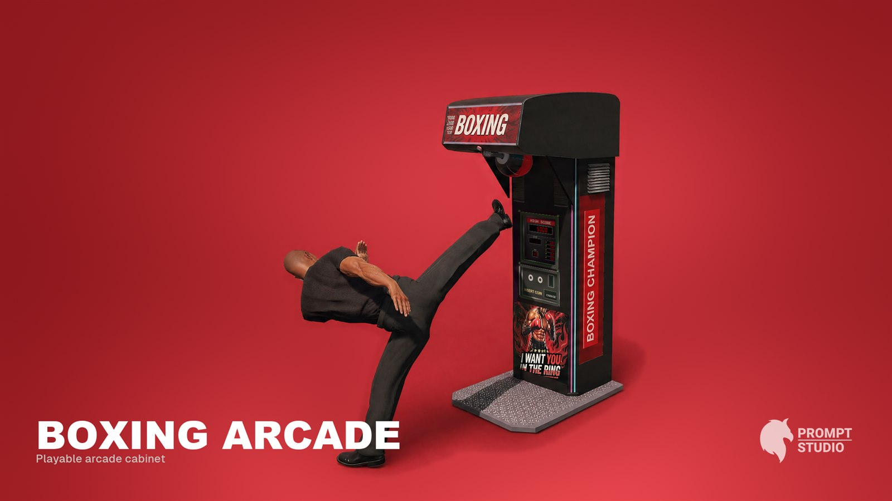
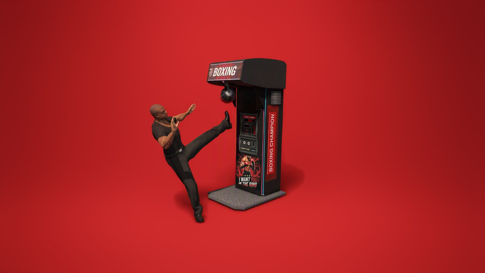

# Boxing Arcade

<figure><figcaption></figcaption></figure>

A **working boxing punch machine** for your bars, gyms, arcades and clubs. Walk up, press
interact, and time your hit on a 3-stage circle minigame — how far you get picks the **punch
animation tier**, how close you hit picks the **score**. The ped and the cabinet play
frame-matched animations, the cabinet screen is live (leaderboard, punch splash, animated score
roll-up), and the machine **talks back** — reaction voice lines laddered by your score.


**Zero dependencies.** No `ox_lib`, no database, no required framework or target script —
everything optional is auto-detected at runtime. On a fully standalone server the machine
simply runs in free-play mode.


***

### Requirements

* A FiveM server. That's it.

Optional, **auto-detected** if present:

* [`ox_target`](https://github.com/overextended/ox_target) **or** `qb-target` — interact prompt. Without either, a built-in `[E]` proximity prompt takes over.
* **Framework** (QBox / QBCore / ESX) — used to charge per play and show character names on the leaderboard. Without one, play is **free** and names fall back to the player name.
* **BigDaddy-Money** — used for payment automatically when running.
* **Gym script** (`rtx_gym` / `vms_gym` / `OT_skills` / `devhub_skillTree`) — award strength per punch, see [Configuration](configuration.md#stats-award-gym-strength-per-punch).

***

### Installation



#### Copy the resource

Drop `prompt_boxing_machine` into your `resources` folder.



#### Add to server.cfg

```
ensure prompt_boxing_machine
```

If you use a framework or a targeting resource, start those **before** it.



#### Grant creator access

Machines are placed **in-game**. Give yourself the creator permission:

```
add_ace group.admin prompt_boxing.creator allow
```

(or set `Config.devMode = true` on a dev server — see [Placing Machines](placement.md#who-can-place)).



#### Start it — cabinets are already out there

The resource ships **ready to play**: 33 default placements at busy spots (Legion,
Vespucci Beach, Del Perro Pier, Vinewood, the casino, Sandy Shores, Paleto, Chumash…),
plus [map-pack presets](placement.md#map-packs-ship-machines-with-your-maps) for Prompt
maps that activate only when the map is running.

Don't like a spot? Remove it from `config/machines.lua`. Want more? Stand where the
cabinet should go and run `/boxarcade` — in-game placements persist in `data/machines.json`.



***

### First-boot checklist

On boot the server console prints a health report:

```
[boxing] boot report
  framework: qbcore
  target:    ox_target
  payment:   disabled
  stats:     off
  language:  en
  machines:  33 config + 2 placed + 0 map
  modules:   creator=true leaderboard=true
  devMode:   false   debug: false
```

| Check | What to look for |
| --- | --- |
| Framework detected | `framework:` shows `qbox` / `qbcore` / `esx` / `standalone` |
| Targeting detected | `target:` shows `ox_target` / `qb-target` / `none` (none = built-in `[E]` prompt) |
| Machines exist | `machines:` shows `33 config + …` out of the box — all zeros means the default list was emptied and nothing was placed yet |
| Production flags | `devMode: false   debug: false` on a live server |

***

### How it plays

<figure><figcaption></figcaption></figure>

```
walk up → [E] → ped steps in, presses the button → timing minigame → PUNCH
        → score rolls up on the screen (machine reacts) → [E] play again  /  [X] leave
```

* **The minigame:** a selector sweeps a ring — hit `E` (or `Space`) as close to the gold arc
  as you can. Three levels, each faster with a smaller arc. Miss early = light punch, low
  score; hit the tiny level-3 arc = high tier, up to 10 000. **Every circle counts:** the
  score blends the accuracy of all your hits (later circles weigh more), so one lucky final
  hit can't carry two sloppy ones.
* **The secret bonus round:** near-perfect play on all three arcs opens a hidden 4th circle —
  scores up to **12 000**.
* **9 punch animations** across 3 strength tiers, plus enter, idles and celebration moves —
  the cabinet plays a frame-matched twin clip for every one of them.
* **The machine talks:** reaction lines picked by your score band when the roll-up lands, and
  attract lines that goad you if you step up but don't swing.
* **Leaderboard:** global, all-time, one row per player (their best), shown on every cabinet
  screen. Stored as JSON — no database.
* Up to **8 cabinets side by side**, each with its **own live screen** (the resource ships 8
  model variants and assigns them automatically so neighbours never share).


**Performance:** away from machines the resource idles at **0.00 ms** — one lightweight
proximity check every 500 ms is all that runs. Cabinets, screens and sounds only exist for
players near them.


***

### What's inside

<table data-view="cards"><thead><tr><th>Section</th><th></th><th data-card-target data-type="content-ref">Link</th></tr></thead><tbody><tr><td><strong>Placing Machines</strong></td><td>The /boxarcade creator panel — place, move, price, bind to maps</td><td><a href="placement.md">placement.md</a></td></tr><tr><td><strong>Configuration</strong></td><td>Payment, minigame tuning, languages, stats, blips</td><td><a href="configuration.md">configuration.md</a></td></tr><tr><td><strong>For Developers</strong></td><td>Hooks, exports, custom money / minigame / notify</td><td><a href="developers.md">developers.md</a></td></tr><tr><td><strong>Troubleshooting</strong></td><td>No prompt, no cabinets, free plays, support dump</td><td><a href="troubleshooting.md">troubleshooting.md</a></td></tr></tbody></table>
